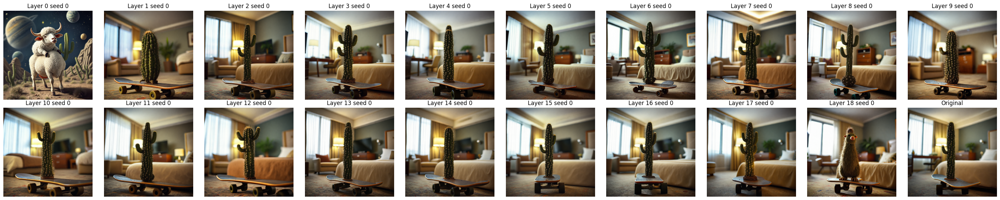
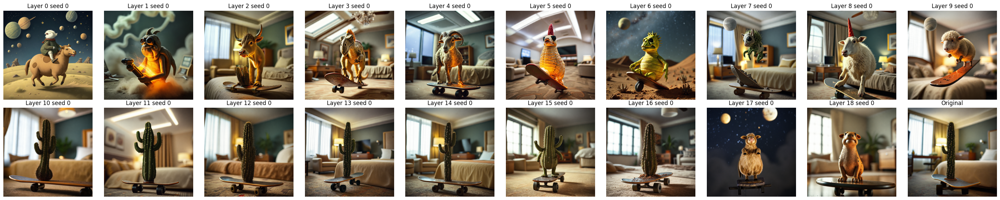
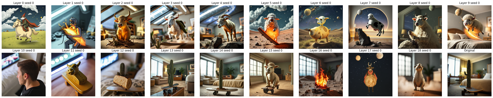

# Ablations


## 1. Deactivate single layers
Prompt: `"A cinematic shot of a unicorn walking on a rainbow."`
### TransformerLayers
Observations:
1. Layers 0, 1, 2 seem to be vital for image formation (actually responsible for painting the image)
2. All the other layers seem to be editing the image so to get variation of the same subject, not impacting alone the semantic. It does not seem any of these layers uniquely contain any of the concepts present in the image. Maybe these concepts are over-represented in multiple layers.

### SingleTransformerLayers
Observations:
1. The last two layers seem to be intervening on the textures
2. Also here, all the other layers individually seem to be performing transformations related to the scenic rendering (not the semantic). Maybe they are specialized for specific features (e.g. facial features require some specific details maybe many of those layers are for these). In either cases, no one of them seem to be vital for this prompt.

## 2. Deactivate blocks of consecutive layers
Since it 


# New ablations
We denote `z` latents of our image and `z'` latents of another image, `p` prompt for our image (t5 emb), `p'` prompt for another image, `c = (t, pool(p))` conditioning information (timestep and pooled prompt with clipembedding) and `c' = (t, pool(p'))` conditioning info for other image.
The first layer computes this map
$$
(z, p, c) \to (z + f_1(z, p, c), p + g_1(z, p, c)) =: (z_1, p_1)
$$
and 
$$ 
(z', p', c') \to (z' + f_1(z', p', c'), p' + g_1(z', p', c')) =: (z'_1, p'_1)
$$ 
### First attempt
If we try to edit the attention (+ ff) output with a different seed (so z != z'):
$$ (z, p, c) \to (z + f_1(z', p', c'), p' + g_1(z', p', c'))
$$
We get a noisy output (hypothesis: this is due to the substitution of the seed, since the denoising scheduler takes z as input something changes and we break the denoising process if we change with z')


Instead we edit only the prompt p' so that 
$$
(z, p, c) \to (z + f_1(z, p', c), p' + g_1(z, p', c))
$$
Similarly, for SingleTransformerLayer
$$
(p|z, c) \to p'|z + f_1(p'|z, c)
$$
(we are using seed 0 and seed 1 for the second prompt).
Note that we can do the same operation on each layer, with the only difference being that `g` will depend on z' -> that is the only entrypoint for the information about the other seed z'.


Note that as we go closer to the end the output depends only on promp1 and the seed of prompt2 (but not on the prompt2)!


## Text attention injection
```
(z, p, c) -> (z + f(z, p', c), p + w * g(z, p', c))
```
If `w = 1`



If `w = 5`



If `w = 10`




