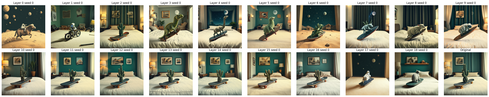

# Ablations

## 1. Deactivate single layers
Prompt: `"A cinematic shot of a unicorn walking on a rainbow."`
### TransformerLayers

Observations:
1. Layers 0, 1, 2 seem to be vital for image formation (actually responsible for painting the image)
2. All the other layers seem to be editing the image so to get variation of the same subject, not impacting alone the semantic. It does not seem any of these layers uniquely contain any of the concepts present in the image. Maybe these concepts are over-represented in multiple layers.

### SingleTransformerLayers

Observations:
1. The last two layers seem to be intervening on the textures
2. Also here, all the other layers individually seem to be performing transformations related to the scenic rendering (not the semantic). Maybe they are specialized for specific features (e.g. facial features require some specific details maybe many of those layers are for these). In either cases, no one of them seem to be vital for this prompt.

## 2. Deactivate blocks of consecutive layers

Since it 