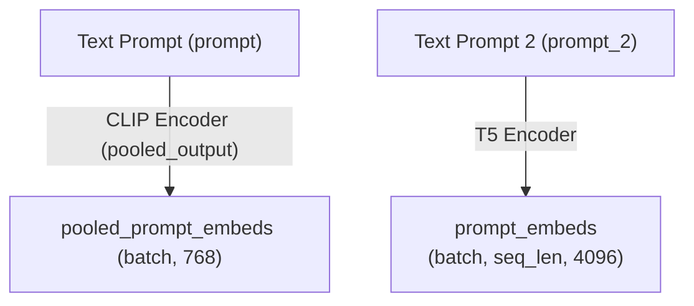

# **FLUX.1 Schnell Architecture Overview**

The **FluxTransformer2DModel** is the core backbone of the **FLUX.1 Schnell** model.

---

## **📌 Model Components**
### **1. Positional & Context Embeddings**
- **FluxPosEmbed**: Provides 2D positional embeddings.
- **CombinedTimestepTextProjEmbeddings**: Merges **timestep embeddings** (used for diffusion) and **text embeddings** (guiding the image generation).
  - **Timestep Embeddings (TimestepEmbedding)**
    - Two linear layers with SiLU activation.
  - **Text Embeddings (PixArtAlphaTextProjection)**
    - Similar structure to timestep embeddings but for textual input.
- **Context & Input Embeddings**
  - **context_embedder**: Maps input text features (4096) to model dimensions (3072).
  - **x_embedder**: Projects input tokens (64) to model dimensions (3072).

---

### **2. Transformer Blocks**
#### **FluxTransformerBlock (19 Layers)**
Each transformer block consists of:
- **AdaLayerNormZero**
  - **Adaptive Layer Normalization**
  - Uses SiLU activation.
  - Projects features from 3072 → 18432 dimensions.
- **Attention Mechanism**
  - Uses **RMSNorm** for normalizing query (Q), key (K), and value (V).
  - Multiple **projection layers** (to_q, to_k, to_v).
  - **Output Layers**
    - `to_out`: Two linear layers with dropout.
    - `to_add_out`: Additional projection for residuals.
- **Feed-Forward Networks (FFN)**
  - Uses **GELU activation**.
  - Expands features from **3072 → 12288 → 3072**.

#### **FluxSingleTransformerBlock (38 Layers)**
- **AdaLayerNormZeroSingle**: Similar to AdaLayerNormZero but adapted for single-path attention.
- **Projection MLP**
  - Expands from **3072 → 12288** dimensions using GELU activation.
  - Outputs **15360 → 3072** features.
- **Self-Attention Mechanism**
  - Uses RMSNorm normalization.
  - Query (Q), Key (K), Value (V) projection layers.

---

### **3. Output Processing**
- **AdaLayerNormContinuous**
  - Applies SiLU activation.
  - Expands 3072 → 6144.
- **Projection Layer**
  - Final output layer projects from **3072 → 64**.

---

## **🔎 Summary**
| Component | Function |
|-----------|----------|
| **FluxPosEmbed** | Encodes positional information. |
| **Timestep & Text Embeddings** | Projects time steps and text prompts to a shared latent space. |
| **Transformer Blocks (19x)** | Multi-headed self-attention and feed-forward networks for feature processing. |
| **Single Transformer Blocks (38x)** | Lightweight transformer layers focusing on refinement. |
| **AdaLayerNorm & Attention** | Normalization and query-key-value attention mechanisms. |
| **Final Projection (proj_out)** | Outputs the final image feature representation. |

---

## **🚀 Key Takeaways**
✅ **Hybrid Transformer-Diffusion Model** optimized for fast inference.  
✅ **Lightweight and Efficient** with only **64 output features**.  
✅ **Advanced Attention Mechanisms** (RMSNorm + Multi-Head Projections).  
✅ **Adaptive Normalization** (AdaLayerNorm) for stability in training.  

---

This structured breakdown should help you understand the architecture at a glance. Let me know if you need any deeper insights! 🚀

## Computational Graph

