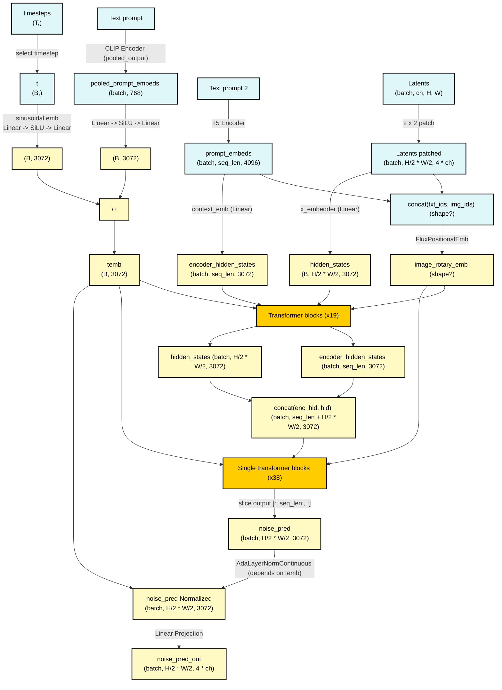

# **FLUX.1 Schnell Architecture Overview**

## Computational Graph
Dimensions considered:
- `H` = height of latents
- `W` = width of latents
- `ch` = channels of latents
- the hidden dimension is 3072 (as reported in the graph)


Pay attention to output **AdaLayerNormContinuous(temb, x)**:
1. Applies SiLU(temb) -> Linear (3072 → 6144) -> split in `scale`|`shift` (both with shape `(batch, 3072)`)
2. outputs `standardize(x) * (1 + scale)[:, None, :] + shift[:, None, :]`


## Transformer Blocks (19 layers)
These blocks are introduced in the [SD-3 paper](https://arxiv.org/abs/2403.03206). TODO
```mermaid
graph TD


```

In particular, pay attention to:
- **AdaLayerNormZero**
  - **Adaptive Layer Normalization**
  - Uses SiLU activation.
  - Projects features from 3072 → 18432 dimensions.
- **Attention Mechanism**
  - Uses **RMSNorm** for normalizing query (Q), key (K), and value (V).
  - Multiple **projection layers** (to_q, to_k, to_v).
  - **Output Layers**
    - `to_out`: Two linear layers with dropout.
    - `to_add_out`: Additional projection for residuals.
- **Feed-Forward Networks (FFN)**
  - Uses **GELU activation**.
  - Expands features from **3072 → 12288 → 3072**.


## Single Transformer Blocks
These blocks are introduced in the [DiT](https://arxiv.org/abs/2212.09748) paper.

In particular, pay attention to:
- **AdaLayerNormZeroSingle**: Similar to AdaLayerNormZero but adapted for single-path attention.
- **Projection MLP**
  - Expands from **3072 → 12288** dimensions using GELU activation.
  - Outputs **15360 → 3072** features.
- **Self-Attention Mechanism**
  - Uses RMSNorm normalization.
  - Query (Q), Key (K), Value (V) projection layers.
