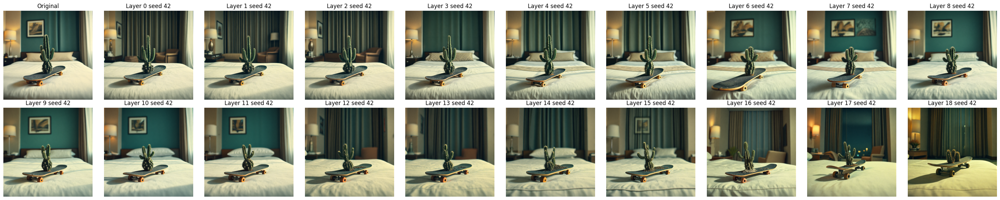
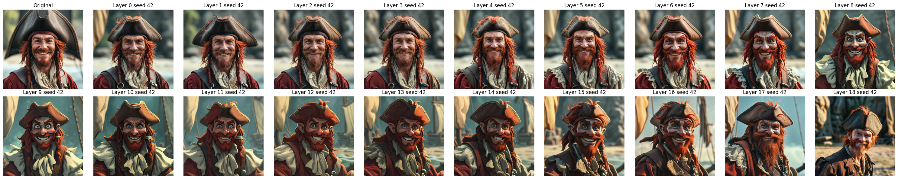
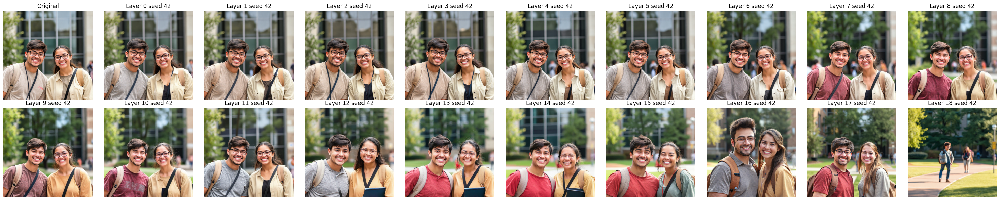
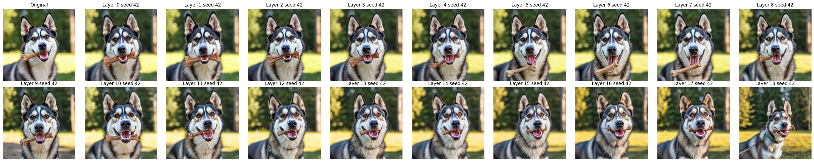
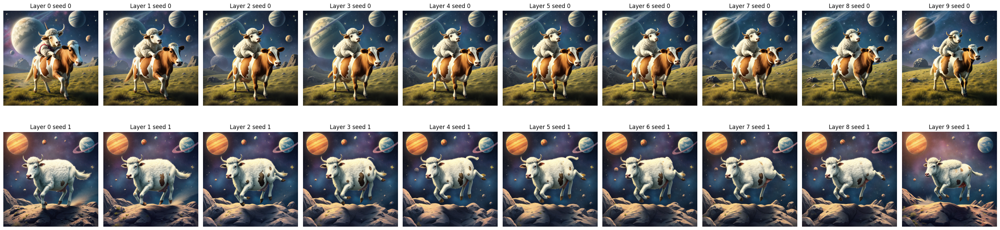

# Text stream ablations
Questions:
1. What information does the text-stream carry and how this changes throughout layers?
2. Is the text-embedding space transformed in intermediate text-stream outputs? 

Note: we denote `output = residual + activation`


## Test 1: use intermediate text-stream output as input (substituting prompt-embedding)





Conclusion: the intermediate text-stream outputs can be used as input. Consequences:
1. They live in the same/compatible space, they are shifted by transformer blocks `x + shift(x)`
2. If we provide them as input to the model we can check what information about the prompt is still present (useful for subsequent experiments).

### Side-test: is structure-info in the text-stream?
Very Important note: by ablating with different seeds, we checked what information is present in the text-stream at any layer. As a rule of thumb, what changes by using different seeds is not dictated by prompt but is due to randomness. 


Conclusion: even though there is some shift in the information contained, main semantic information contained in the prompt are still there and there is no visible addition, since all the elements not specified in the prompt change with the seed. Therefore, structural information (i.e. segmentation, depth, shapes, how many subjects are there and where) is somehow stored in the image-stream.

## Test 2: use intermediate image-stream output as input (substituting prompt-embedding)
Since the output of the network has to predict noise, at first we suppose that we cannot use intermediate image-stream output as input.
We can think (in a reparameterized way) of some noise that has to become an image, so every layer contribute of some part of this prediction.


The prompts were
periment with
- `SPACE_PROMPT = "A sheep riding a cow in the space, there are planets and stars in the background."`
- `CACTUS_SKATEBOARD_PROMPT = "A cinematic shot of a cactus on a skateboard in a hotel room."`
- `GIRL_CAT_PROMPT = "A picture of a smiling girl with a red t-shirt holding a cat."`
- `PROMPT_PIRATE = "A pirate with red hair smiling to the camera."`
- `PROMPT_COUPLE = "A couple of students smiling to the camera."`
- `EMPTY_PROMPT = ""`

An **interesting thing**: in output layer 1 case, only what is in the prompt is depicted in the final image. 
If we tune the prompt so that 
- `REFINED_SPACE_PROMPT = "A sheep riding a cow in the space, there is a school in background."`
- `REFINED_CACTUS_SKATEBOARD_PROMPT = "A cinematic shot of a cactus on a skateboard."`
- `REFINED_GIRL_CAT_PROMPT = "A picture of a smiling girl with a red t-shirt holding a cat in a park."`
- `REFINED_PROMPT_PIRATE = "A pirate with red hair smiling to the camera on a pirate sheep."`
- `REFINED_PROMPT_COUPLE = "A couple of students smiling to the camera, there are green cats in the background."`
we are gonna get these (so we can confirm the assertion "in output layer 1 case, only what is in the prompt is depicted")

NOTE: this effect doesn't change even if we use different prompts in the first generation. 
Moreover, information present in the first prompt is never visible in any layer of the equivalent plot (we get very few variation of the same effects from layer > 10)


## Questions 
1. Where is the background knowledge used to fill the image (with non prompt stuff) stored and how is it accessed?
2. MLP can be seen as associative memory, we can try to check the attention 

## Test 3: inject text-stream activation from another prompt


# Flux algorithm
Layer 1.0-1.18 are TransformerBlocks; layer 2.0-2.37 are SingleTransformerBlocks.

At layer 1.0:
- image stream: -
- text stream: overwrite the information presetn


By layer 1.17 -> the model decided segmentation, how many subject are and where
Layer 1.18  -> the model decides who are the subject
Layer 2.1 -> the model decides subject and details about it (there might be some mixing)
Layer 2.1-2.2 -> the model decides the background
Layer 2.1-2.16 -> the model decides details (e.g. color of tshirt) not present in the prompt
Layer 2.16-end -> the model uses text-stream only for darkness change, refines the generation of the image with low level information.

**Background shapes**
LAyers 1.16/1.17 -> decide info about shapes of background
To be precise: at layer 1.16 and 1.17 in the text stream there are (somehow) info of the background

Layers 1.12 (see effect in 1.13) -> decide info about segmentation of subject/subjects

Note: if we change the seed 

process: sample from p(z | p, seed) -> sample from p(x | z, p, seed)
z = (semantic, structure)
x | z = (details, low_level_features)


seed -> p   but only from layer 1.3/1.4 for hardly perceptible variation in low_level_info, layer 1.6/2.4 for details, then only see darkness change


Layer 1.(17) # something also with 9, 10, 16
image_stream.read_from_text_stream_and_lock("shapes about background")


Layer 1.12 and 1.13 has blocked subjects location 
then up to 1.18 who are the subjects is decided

Specifically: layer 1.12
```
location_subjects = image_stream.read_from_text_stream("location of the subjects")
num_of_subjects = image_stream.read_from_text_stream("num of subjects")
```

Layer 1.18
```
who_are_subjects = image_stream.read_from_text_stream("subjects semantic") -> if something is missing here you should use some sort of bias/background knowledge to complete
```