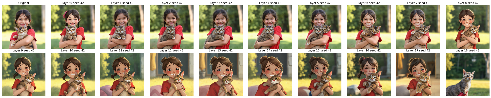

# Text stream ablations
Questions:
1. What information does the text-stream carry and how this changes throughout layers?
2. Is the text-embedding space transformed in intermediate text-stream outputs? 

Note: we denote `output = residual + activation`

## Test 1: use intermediate text-stream output as input (substituting prompt-embedding)

Conclusion: the intermediate text-stream outputs can be used as input. Consequences:
1. They live in the same/compatible space, they are shifted by transformer blocks `x + shift(x)`
2. If we provide them as input to the model we can check what information about the prompt is still present (useful for subsequent experiments).

