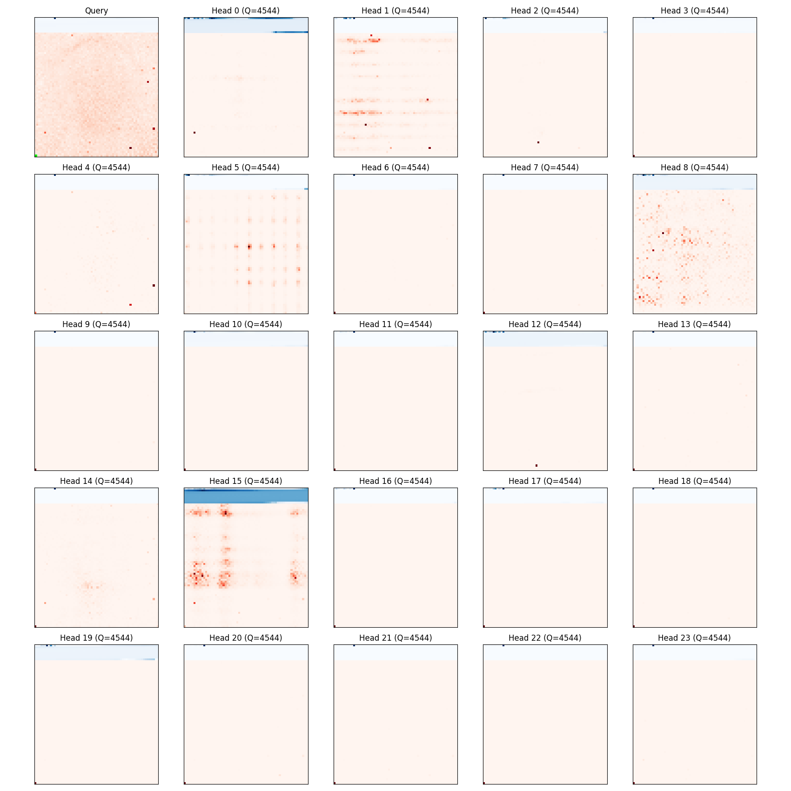
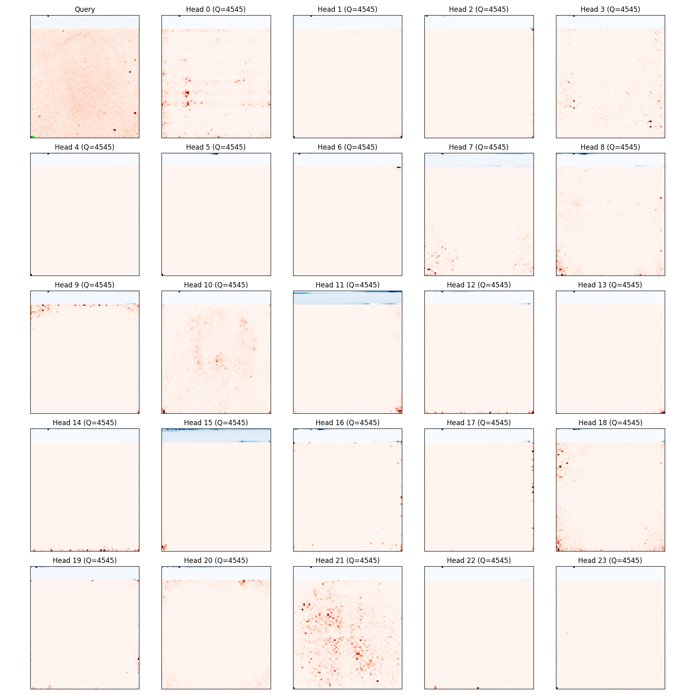
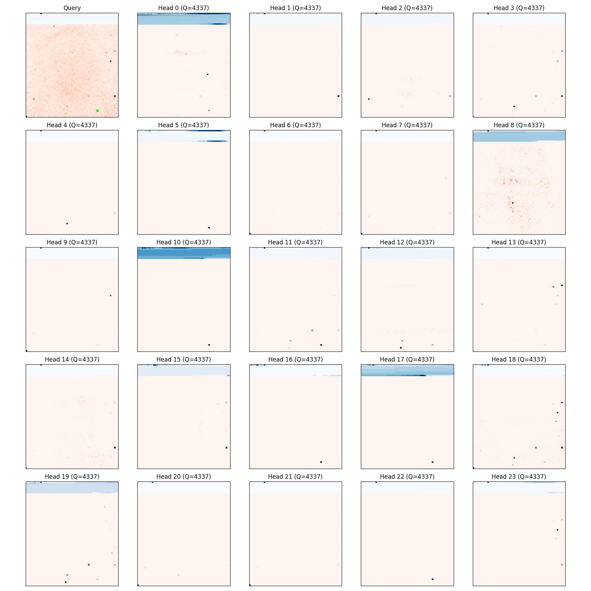
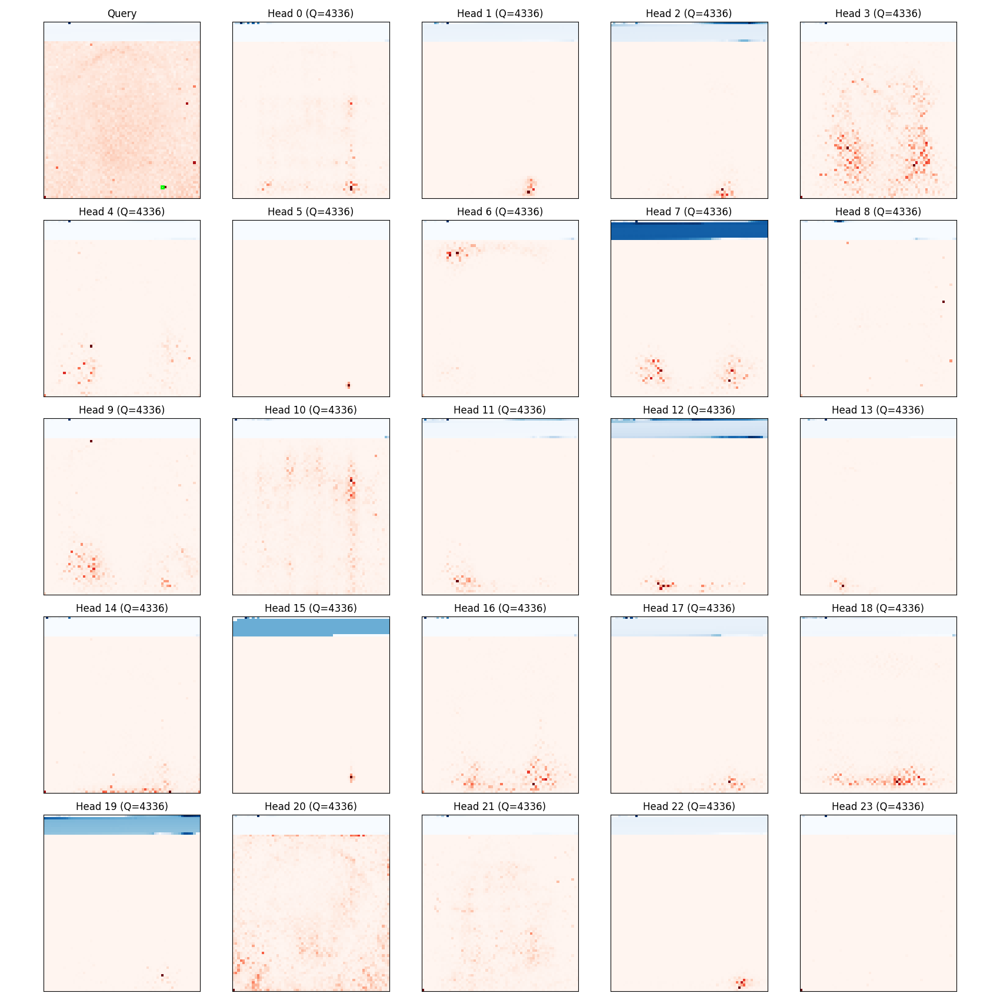
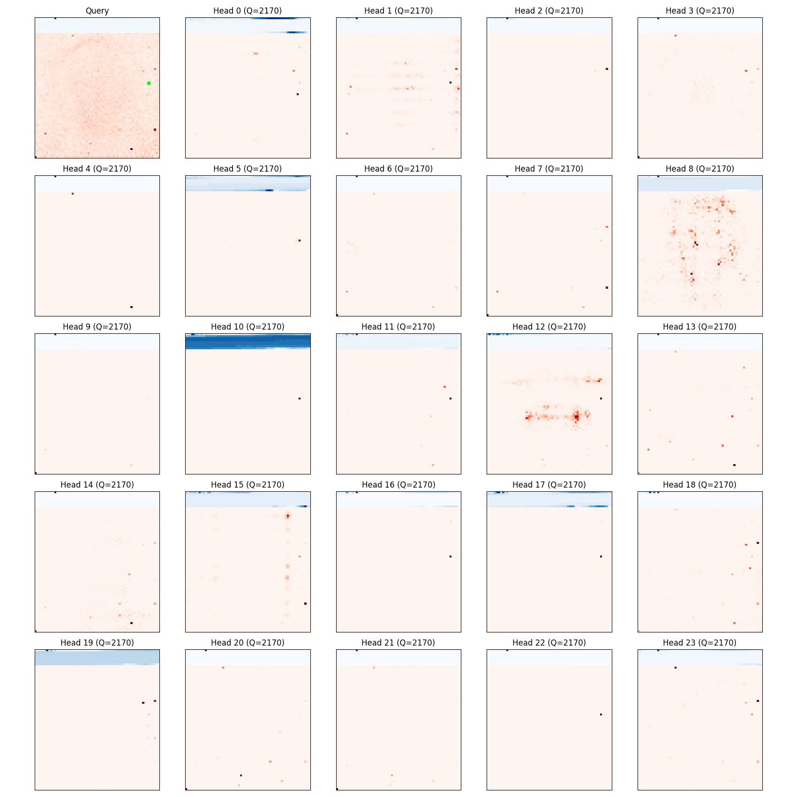
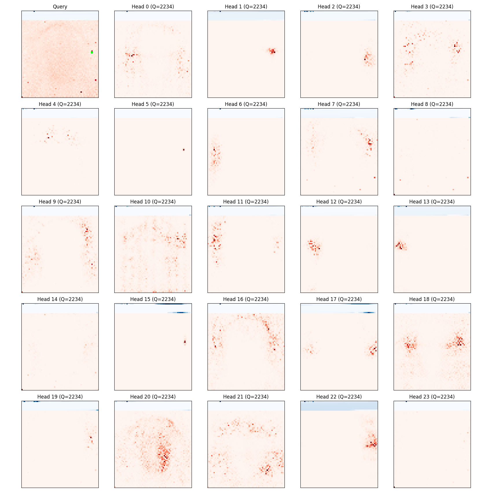
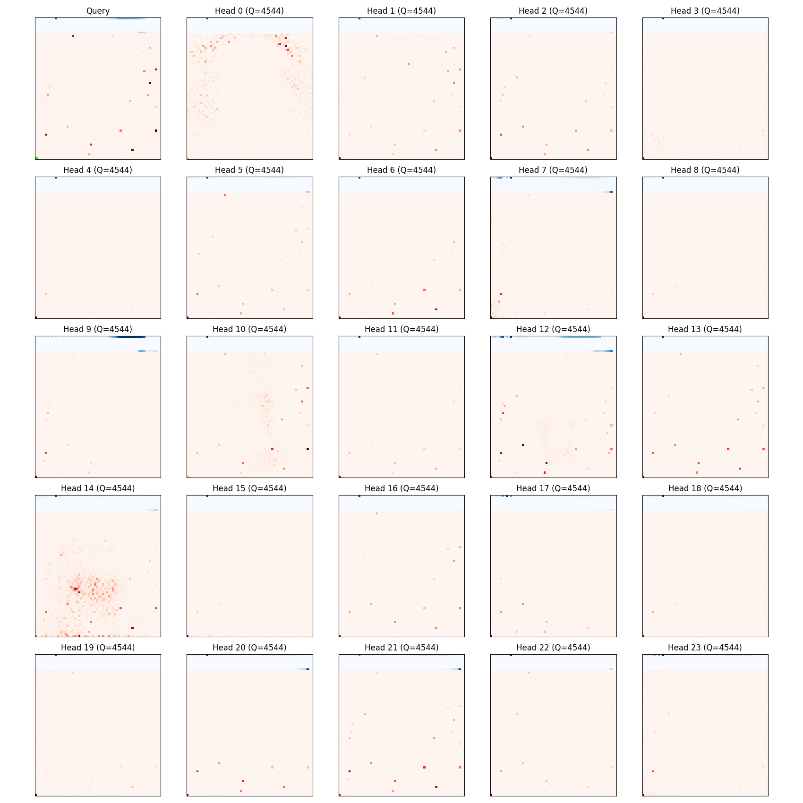
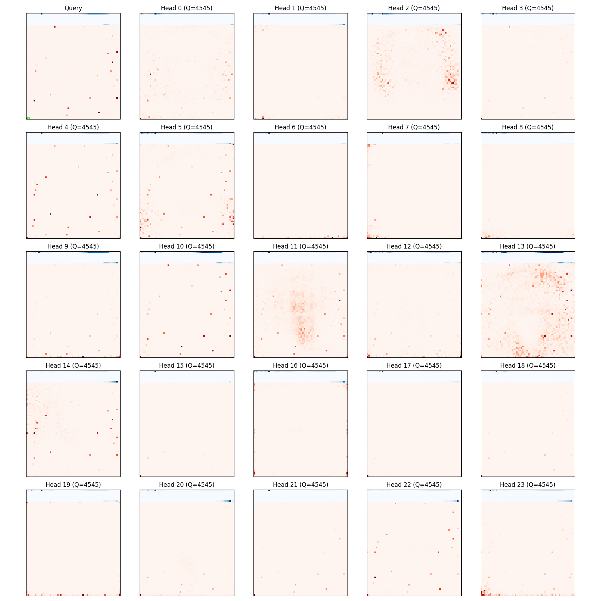

### When Writing a register (left) vs writing a neighboring non-register (right) 
 
 
 
Notes:
1. Most of attention heads for a register are very sparse and attend to other locations for registers
2. Most attention heads fro non register are less sparse and attend to many close or general locations

### What a register reads (left) vs reading from a neighboring non-register (right)
 
 
 
